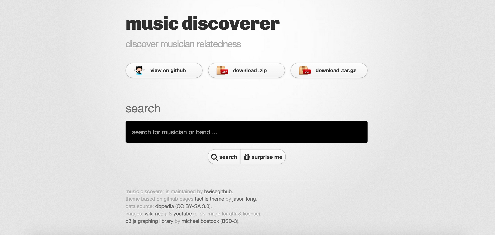
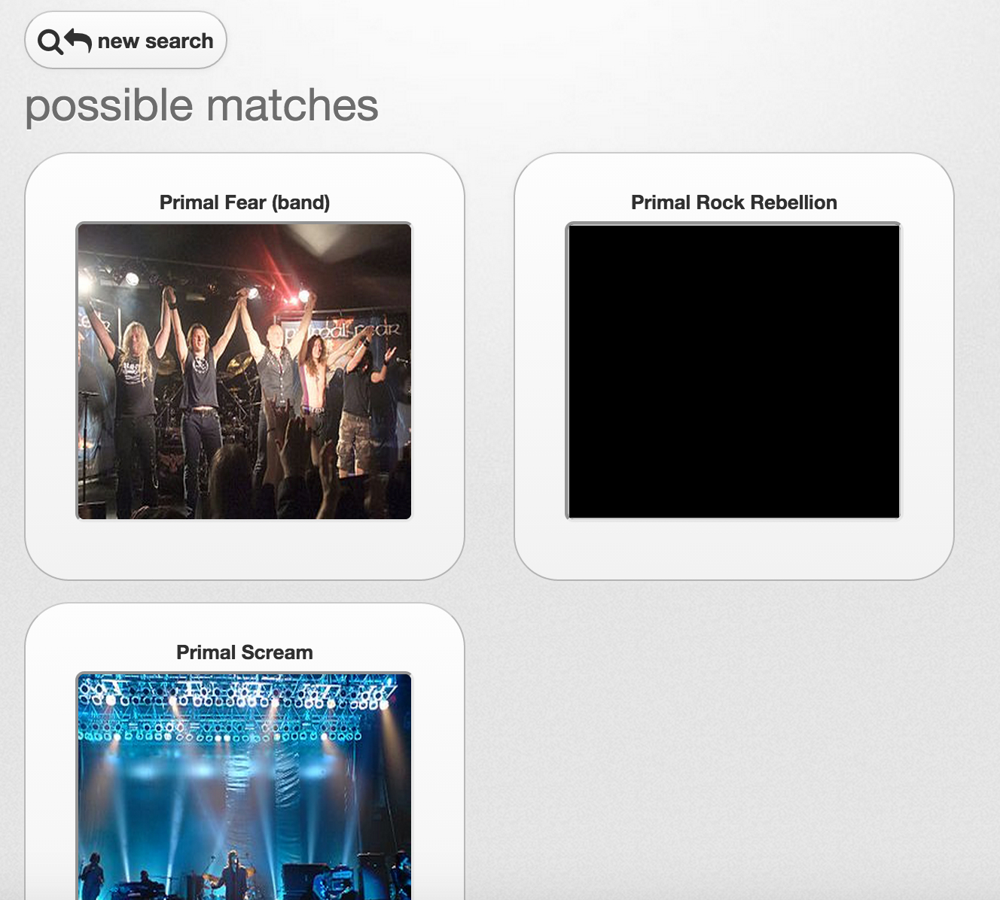
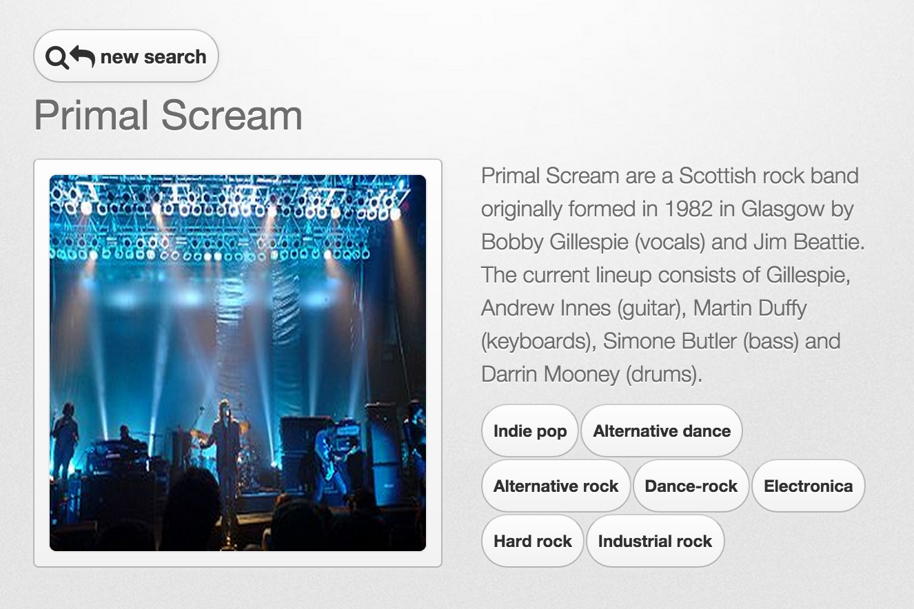
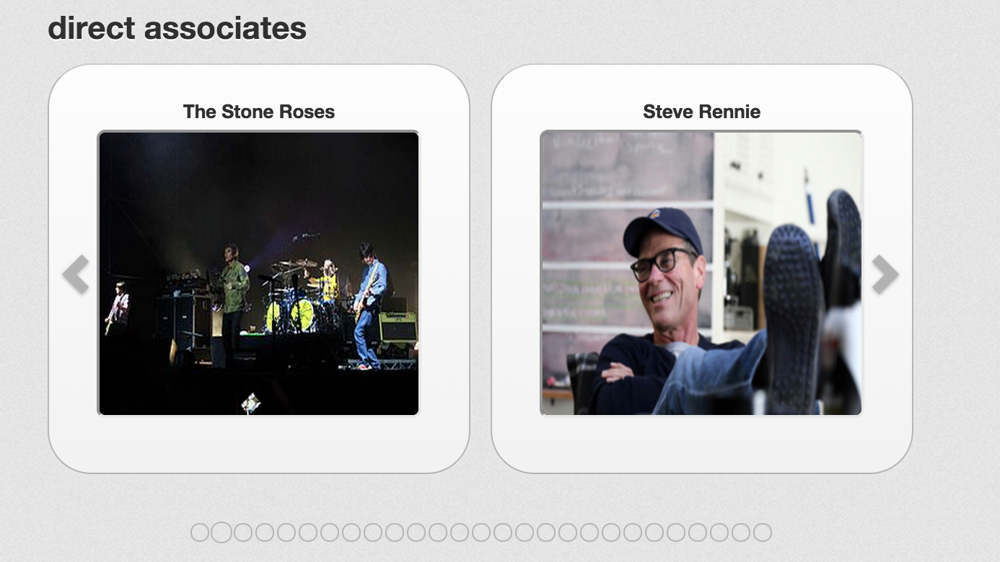
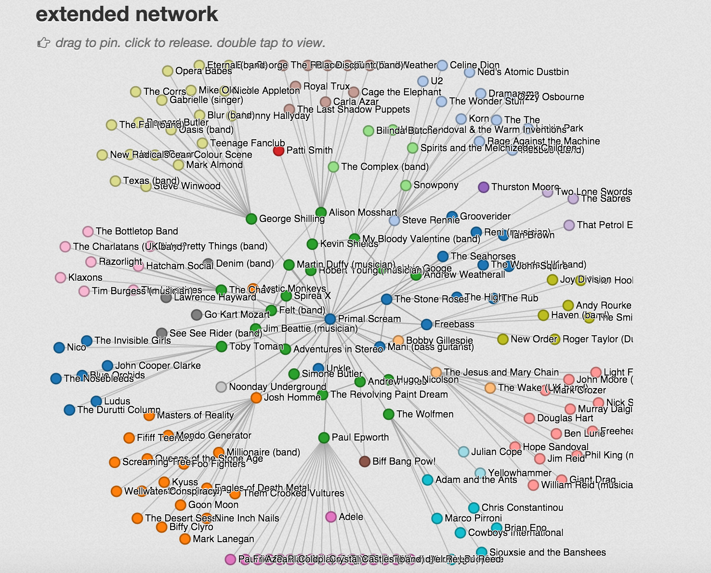
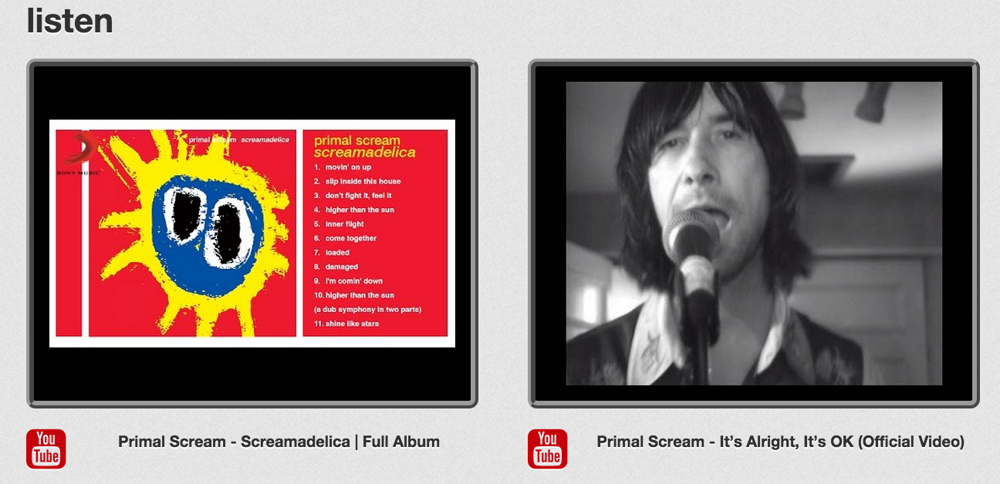
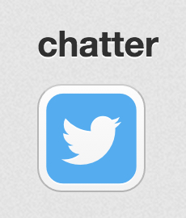

angularjs-music-discoverer
==========================
Web-based tool to discover musician-relatedness

## Live Demo Site

https://bwisegithub.github.io/angularjs-music-discoverer/

*Note:*
* Uses dbpedia.org's public SPARQL endpoint, which unfortunately has frequent outages and/or lack of responsiveness.  If searches time out, please try again later.

## Screenshots

### Search Screen
*Features:*
* Searches by keyword(s)
* "Surprise me" yields random musician

*Note:*
* Currently limits results to rdf:type dbpedia-owl:Band and dbpedia:owl MusicalArtist, although other types may show up in the associated musicians if the associated entity listed the featured musician as dbpedia-owl:associatedMusicalArtist, or vice versa.

### Possible Matches (Search Result List) Screen
*Features:*
* Thumbnails of all possible matches to the keyword(s) entered on the search screen
  * DBpedia entries that list no wikimedia thumbnail show up as black image placeholders
* Clicking on image shows the musician details screen for chosen musician

### Musician Details Screen

##### Musician Section
*Features:*
* If available, genre buttons show the musician details screen for random musician in chosen genre
* If applicable, clicking on musician image opens new window to show Wikimedia attribution and license for image

##### Direct Associates Section
*Features:*
* Carousel with thumbnail of all direct associates
* Clicking on thumbnail shows the musician details screen for chosen musician

##### Extended Network Section
*Features:*
* D3.js force graph shows artist, associated artists, and associates of associates (limited to 500 nodes/musicians)
* Dragging of nodes/musician makes the node "stick", clicking releases, or double clicking shows the musician details screen for chosen musician

##### Listen Section
*Features:*
* YouTube data API search results for first four music videos matching keywords in musician's name/label
* Clicking on result opens new YouTube window to play chosen video/song

##### Chatter Section
*Features:*
* Clicking on twitter logo button opens new window to see twitter search results matching keywords in musician's name/label

## Credits
* Theme based on GitHub pages <a target="_blank" href="https://github.com/jasonlong/tactile-theme">Tactile Theme</a> by <a target="_blank" href="https://twitter.com/jasonlong">Jason Long</a>
* Data source: <a target="_blank" href="http://dbpedia.org">DBpedia</a> (<a target="_blank" href="https://creativecommons.org/licenses/by-sa/3.0/">CC BY-SA 3.0</a>)
* Images: <a target="_blank" href="https://commons.wikimedia.org">Wikimedia</a> &amp; <a target="_blank" href="https://www.youtube.com">YouTube</a> (click image for attr &amp; license)
* <a target="_blank" href="https://github.com/mbostock/d3">D3.js graphing library</a> by <a target="_blank" href="https://github.com/mbostock">Michael Bostock</a> (<a target="_blank" href="https://github.com/mbostock/d3/blob/master/LICENSE">BSD-3</a>)